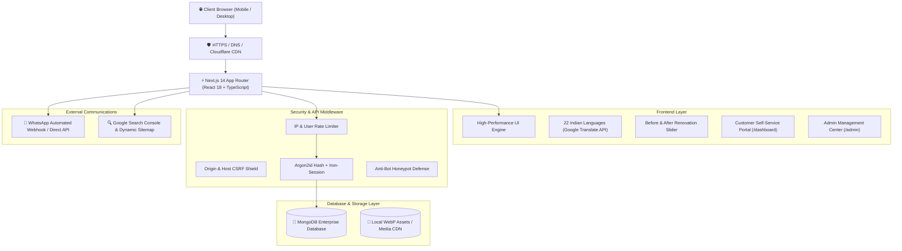
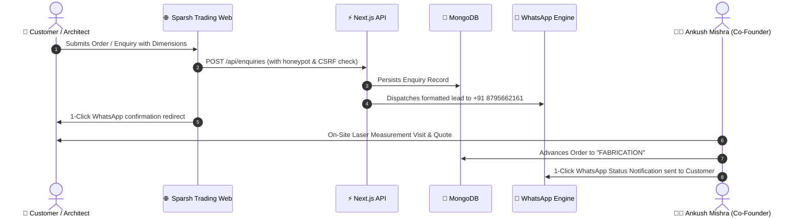
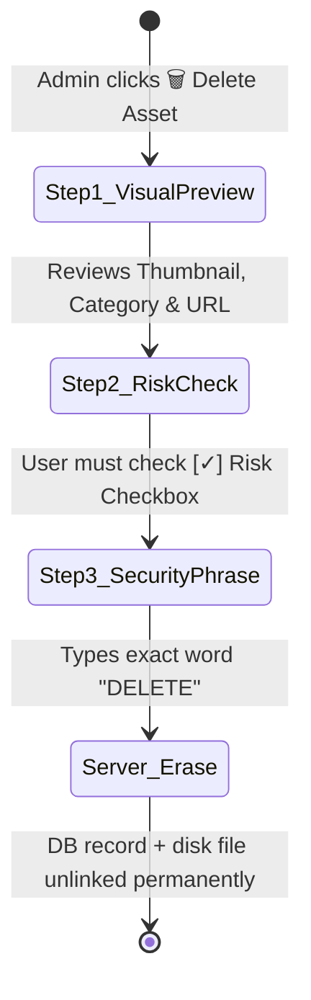

# 🏗️ SPARSH TRADING — Production Enterprise Web Platform

```
  ███████╗██████╗  █████╗ ██████╗ ███████╗██╗  ██╗    ████████╗██████╗  █████╗ ██████╗ ██╗███╗   ██╗ ██████╗ 
  ██╔════╝██╔══██╗██╔══██╗██╔══██╗██╔════╝██║  ██║    ╚══██╔══╝██╔══██╗██╔══██╗██╔══██╗██║████╗  ██║██╔════╝ 
  ███████╗██████╔╝███████║██████╔╝███████╗███████║       ██║   ██████╔╝███████║██║  ██║██║██╔██╗ ██║██║  ███╗
  ╚════██║██╔═══╝ ██╔══██║██╔══██╗╚════██║██╔══██║       ██║   ██╔══██╗██╔══██║██║  ██║██║██║╚██╗██║██║   ██║
  ███████║██║     ██║  ██║██║  ██║███████║██║  ██║       ██║   ██║  ██║██║  ██║██████╔╝██║██║ ╚████║╚██████╔╝
  ╚══════╝╚═╝     ╚═╝  ╚═╝╚═╝  ╚═╝╚══════╝╚═╝  ╚═╝       ╚═╝   ╚═╝  ╚═╝╚═╝  ╚═╝╚═════╝ ╚═╝╚═╝  ╚═══╝ ╚═════╝ 
```

> **The Premier Architectural Metal Fabrication, uPVC Fenestration & Interior Solutions Platform for Uttar Pradesh, India.**
>
> 🌐 **Live URL:** [https://sparshtrading.shop](https://sparshtrading.shop)  
> 🏢 **Headquarters & Workshop:** Meera Bhawan Chauraha, Ashtbhuja Nagar, Pratapgarh, UP — 230001  
> 📞 **Public Contact & WhatsApp Line:** `+91 8795662161` | `+91 7007710096`

---

## 📑 Table of Contents
1. [Executive Summary & Architecture](#-system-architecture)
2. [Leadership & Governance](#-leadership-team--governance)
3. [Key Platform Features](#-flagship-features)
4. [Interactive User & Admin Workflows](#-interactive-system-flowcharts)
5. [WhatsApp Automation Engine](#-whatsapp-automation-architecture)
6. [3-Step Security Deletion System](#-3-step-verified-media-deletion)
7. [SEO, Topical Authority & Regional Indexing](#-seo--google-1-ranking-engine)
8. [Automated QA & Security Gate](#-test-suite--quality-assurance)
9. [Documentation & PDF Guides](#-documentation--user-guides)
10. [Local Development & Deployment](#-deployment--setup)

---

## 🏛️ System Architecture



---

## 👥 Leadership Team & Governance

| Name | Designation | Public Contact Line | Operational Responsibility |
| :--- | :--- | :--- | :--- |
| **Aniket Mishra** | **Owner / Founder** | *Private Record* (`9695041222`) | Strategic Vision, Land & Workshop Assets |
| **Ankush Mishra** | **Co-Founder** | `+91 87956 62161` | Public Inquiries, On-Site Laser Measurements & Quotes |
| **Adarsh Singh** | **Co-Founder** | `+91 70077 10096` | Commercial Operations, Supplier Logistics & Delivery |
| **Akarsh Mishra** | **DevOps & Tech Lead** | *Internal Systems* | Architecture, Security, Cloud DevOps & Automation |

> 🔒 **Public Contact Protection Rule:** All public customer interfaces (Header, Footer, Floating Call buttons, Product pages) strictly display only the two Co-Founders (`8795662161` & `7007710096`).

---

## 🚀 Flagship Features

### 1. 🪟 Comprehensive Product & Fabrication Catalogue
- **Tata Steel Chaukhat (Door Frames):** 16 & 18 gauge anti-termite steel frames, single & double rebate.
- **PPGI Pre-Painted Frames:** Factory-baked weather-proof finish.
- **Soundproof 3-Track uPVC Windows:** Lead-free multi-chamber profiles with Grade 304 SS mosquito mesh.
- **12mm Frameless Glass Railings:** Solid SS 304 spigots with tempered safety glass.
- **CNC Laser-Cut Main Gates:** Heavy structural box sections with brass pivot bearings.
- **Modular Kitchens:** IS:710 Marine Grade BWP Plywood with German soft-close tandem drawers.

### 2. 🔀 Interactive Before & After Renovation Slider
- Live comparison between deteriorating wooden frames / rusted grills and newly installed Tata Steel Chaukhat / 12mm Glass balustrades.
- Smooth mouse-drag and mobile touch-swipe interactions.

### 3. 🌐 Multilingual Accessibility (22 Official Indian Languages)
- Native dropdown selector in the navigation bar supporting:
  *English, हिन्दी, বাংলা, मराठी, తెలుగు, தமிழ், ગુજરાતી, اردو, ಕನ್ನಡ, ଓଡ଼ିଆ, മലയാളം, ਪੰਜਾਬੀ, অসমীয়া, मैथिली, संस्कृतम्, नेपाली, कोंकणी, डोगरी, سنڌي, कश्मीरी, भोजपुरी, संथाली.*

### 4. 🛒 Full-Cycle Customer Dashboard (`/dashboard`)
- Direct order placement form with dimension inputs and material pickers.
- Real-time milestone tracker (`Measurement` ➔ `CAD Drawing` ➔ `Fabrication` ➔ `Installation` ➔ `Completed`).
- Official PDF Invoice viewing and download.

---

## 📊 Interactive System Flowcharts

### Customer Order & Lead Journey



---

## 🛡️ 3-Step Verified Media Deletion

Accidental deletion of gallery and product photos is prevented by a strict 3-step verification system in `/admin/content`:



---

## 🔍 SEO & Google #1 Ranking Engine

- **High-Resolution OpenGraph & Twitter Cards:** 1200x630px social previews optimized for WhatsApp and Facebook link shares.
- **Dynamic XML Sitemap:** Automatically generated at `/sitemap.xml` covering all 8+ regional UP cities, 8 flagship products, services, guides, and case studies.
- **Structured Schema Markup:** `HomeAndConstructionBusiness`, `Product`, `Offer`, `BreadcrumbList`, and `FAQPage` JSON-LD schemas.
- **Google Search Console Tag:** `<meta name="google-site-verification" content="6Xnbq-3OC8tH2EZ7_acIb9Bf49spiVVl_Y57eZ3Z5Gw" />`.

---

## 🧪 Test Suite & Quality Assurance

```bash
# Execute full security, schema, and API test suite:
npm test

# Verify 100% TypeScript type correctness:
npm run typecheck
```

**Quality Benchmarks:**
- ✔️ Argon2id Password Hashing & Salt Verification
- ✔️ Rate Limiter IP Throttling Engine
- ✔️ Anti-Bot Honeypot Defense Validation
- ✔️ Origin & Host CSRF Verification
- ✔️ MIME & Extension Whitelist Mapping
- ✔️ Product Catalogue Schema & Data Quality
- ✔️ Regional UP Local SEO Database Integrity
- ✔️ WhatsApp Automation Message Formatter & URL Generator
- **Result:** **15 / 15 Tests Passing (100%) | 0 TypeScript Errors**.

---

## 📚 Documentation & User Guides

Complete standalone manuals are provided in the `/docs` directory:

1. **Customer User Guide:** [`docs/CUSTOMER_USER_GUIDE.md`](docs/CUSTOMER_USER_GUIDE.md) | Printable HTML: [`docs/CUSTOMER_USER_GUIDE.html`](docs/CUSTOMER_USER_GUIDE.html)
2. **Admin Operations Manual:** [`docs/ADMIN_OPERATIONS_MANUAL.md`](docs/ADMIN_OPERATIONS_MANUAL.md) | Printable HTML: [`docs/ADMIN_OPERATIONS_MANUAL.html`](docs/ADMIN_OPERATIONS_MANUAL.html)

---

## 🛠️ Deployment & Setup

```bash
# 1. Install dependencies
npm install

# 2. Configure environment variables in .env
MONGODB_URI=mongodb://localhost:27017/sparsh_trading
SESSION_SECRET=your_32_char_random_secret_here
APP_URL=https://sparshtrading.shop
WHATSAPP_ALERT_PHONE=918795662161

# 3. Start local development server
npm run dev

# 4. Build optimized production bundle
npm run build
npm start
```

---

*© 2026 Sparsh Trading. All rights reserved. Crafted for excellence in Pratapgarh & Uttar Pradesh.*
